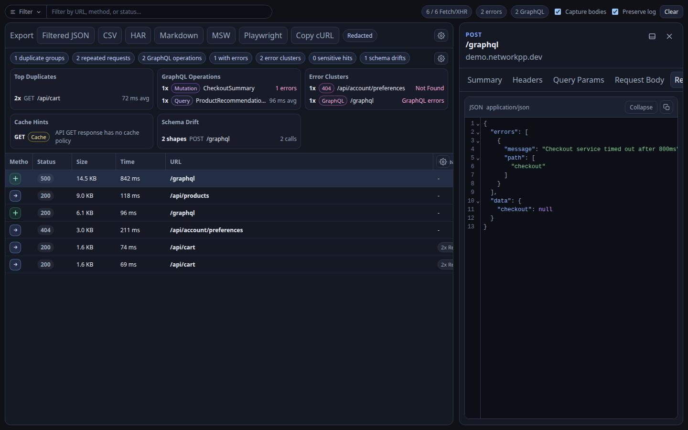
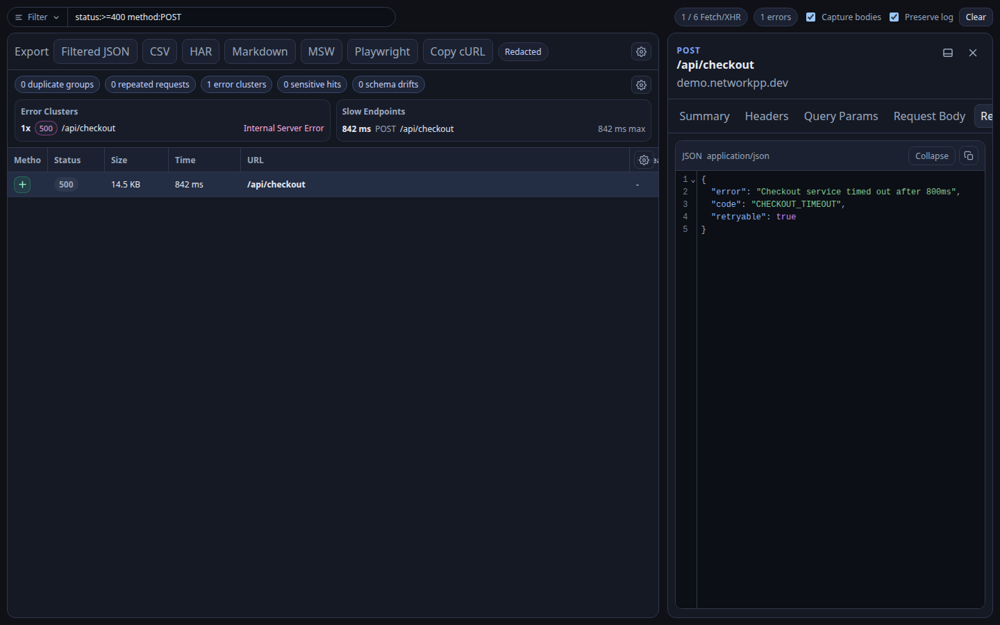
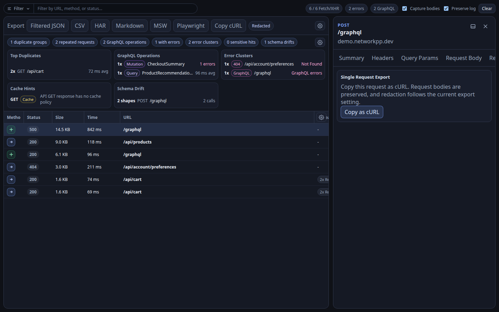
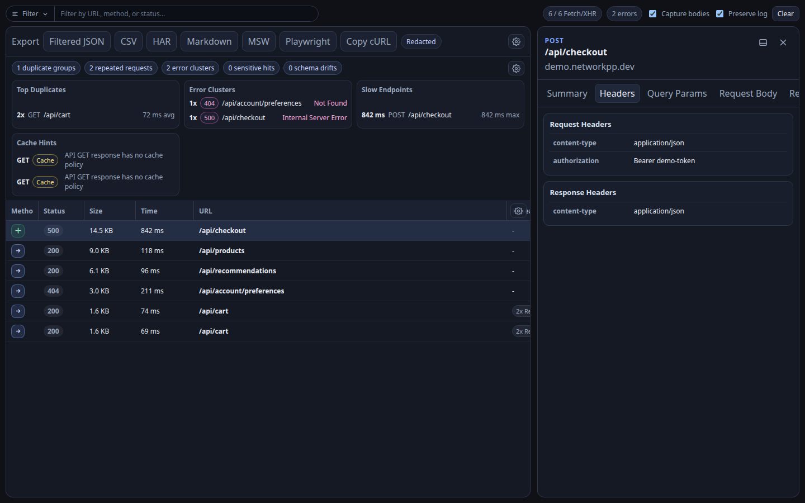

# Network++

> A privacy-first Chrome DevTools network panel for developers who need faster filtering, richer request inspection, GraphQL visibility, and export-ready debugging data.

[](LICENSE)
[](https://wxt.dev)
[](https://developer.chrome.com/docs/extensions)

## [Install Network++ from the Chrome Web Store](https://chromewebstore.google.com/detail/network++/jgoikneccfgcemiakipicalefmnpoljb?authuser=0&hl=en)

Network++ adds a dedicated DevTools panel that keeps the familiar network-debugging workflow, then layers on power tools for modern web apps: structured filtering, request coloring, GraphQL operation insight, local exports, and privacy-conscious defaults.



## Why Network++

Chrome's built-in Network tab is excellent for low-level inspection, but it can be noisy when you are debugging API-heavy applications. Network++ focuses on the workflows developers repeat every day:

- Find the failing, slow, duplicated, or GraphQL requests quickly.
- Inspect headers, query params, request bodies, response bodies, timing, raw HAR data, and generated exports in one place.
- Save and reuse filters like `status:>=400 method:POST`.
- Export useful debugging artifacts without leaking sensitive fields by default.

## Features

### Fast Request Triage

Network++ captures requests from the inspected tab while DevTools is open, then presents them in a purpose-built table with searchable metadata, filter chips, pause/resume capture, preserve-log behavior, and clear visual status cues.



### Request Diff

Pick one request as the compare base, select another request, and inspect a focused diff across status, timing, query params, headers, request payloads, response bodies, and GraphQL variables. It is built for repeated calls where one small payload or response change explains the bug.

### GraphQL-Aware Inspection

GraphQL traffic is detected and surfaced with operation details, operation type, variables, errors, and repeated operation insights so API debugging does not get buried inside generic POST requests.

### GraphQL Variables Inspector

GraphQL requests include a dedicated variables view alongside query, operation, response, and error details. Search, copy, and compare variables without digging through raw POST bodies.

### Saved Debug Sessions

Save captured request sets as named debug sessions, then reload them later for offline inspection, sharing-safe review, or continuing a debugging thread after the live DevTools session is gone.

### Actionable Network Insights

The insights panel highlights duplicate request groups, GraphQL operations, error clusters, slow endpoints, sensitive data hints, cache opportunities, and schema drift signals.

### Export Workflows

Export all requests, filtered requests, or a selected request into formats that are useful outside the browser:

- JSON, CSV, HAR, and Markdown reports.
- MSW handlers for mocked API workflows.
- Playwright route fixtures for end-to-end tests.
- Copy-as-cURL for quick terminal reproduction.
- Right-click any request to open the request context menu with the same export options.



### Local-First Privacy

Captured data stays local to the browser. Response body capture is opt-in, settings and saved filters are stored in `chrome.storage.local`, and exports are redacted by default.

## Screenshots

The repository includes screenshots captured from the real Network++ panel running with safe synthetic demo traffic.

| View | Preview |
| --- | --- |
| Full panel |  |
| Filters |  |
| Request details |  |
| Exports |  |

## Install

Install the published extension from the [Chrome Web Store](https://chromewebstore.google.com/detail/network++/jgoikneccfgcemiakipicalefmnpoljb?authuser=0&hl=en).

To build and run it locally from source:

```bash
npm install
npm run build
```

Then load the extension in Chrome:

1. Open `chrome://extensions`.
2. Enable `Developer mode`.
3. Click `Load unpacked`.
4. Select `.output/chrome-mv3` from this repository.
5. Open DevTools on any page and select the `Network++` panel.

The panel captures requests only while DevTools is open for the inspected page.

## Development

Start WXT in development mode:

```bash
npm run dev
```

WXT writes the development extension to `.output/chrome-mv3`. Keep the dev command running while you work so changes are rebuilt.

Useful commands:

```bash
npm run dev       # Start WXT development mode
npm run typecheck # Validate TypeScript
npm run build     # Build the production extension
npm run zip       # Package the extension as a zip
npm run release:patch # Bump the extension patch version, build, and zip
```

## GitHub Pages

The launch site lives in `docs/` and is intentionally static. To publish it:

1. Push the repository to GitHub.
2. Open the repository settings.
3. Go to `Pages`.
4. Set the source to `Deploy from a branch`.
5. Select the default branch and `/docs`.

## Roadmap

- Chrome Web Store package and release workflow.
- Real screenshot set captured from sample traffic.
- More deterministic demo data for docs and testing.
- Additional request classification rules.
- Import/export of saved filter presets and saved debug sessions.

## Contributing

Contributions are welcome. Please read `CONTRIBUTING.md` before opening a pull request.

## Security And Privacy

Network++ handles potentially sensitive request data. Please do not open public issues with secrets, tokens, production payloads, or private URLs. See `SECURITY.md` for responsible reporting guidance.

## License

MIT. See `LICENSE`.
